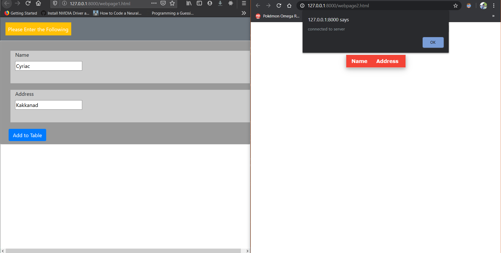

# POCO-websocket-server
This repo contains the code for running a websocket server using the POCO C++ libraries. Two html files are also given to demonstrate.

### Setting up POCO

I assume you will be using a \*unix environment. I am going to show for Debian derived Distros. 
If you want to proceed on Windows, check out [Windows Subsystem for Linux](https://docs.microsoft.com/en-us/windows/wsl/install-win10).
I have used this to get a Debian terminal and it sure works!!
##### Prerequites
install cmake,openssl and other libraries( you'll know what to install when the error appears). Any cmake error->search stackoverflow, it is sure to solve it. Install like the following:

`sudo apt install cmake g++`

##### Download POCO and setup

```bash
cyriac@Cerebro:/home$wget https://pocoproject.org/releases/poco-1.10.1/poco-1.10.1-all.tar.gz
cyriac@Cerebro:/home$tar -xvf poco-1.10.1-all.tar.gz
```

That's gonna take some time.After it extracts, we create a build directory in the same folder. Then, change the directory to poco-1.10.1-all. Here, we set the build folder to the previous build folder and cmake checks the system.The final command builds the POCO Library according to our needs and copies into our build folder.
 
```bash
cyriac@Cerebro:/home$mkdir build
cyriac@Cerebro:/home$cd poco-1.10.1-all
cyriac@Cerebro:/home/poco-1.10.1-all$cmake . -DCMAKE_INSTALL_PREFIX=../build/
cyriac@Cerebro:/home/poco-1.10.1-all$cmake --build . --target install
```

Now,go back to `/home` and check the build folder to see the same output as mine. If done, you are all set.The commands following the output are done for setting the path for the Dynamic linking of libraries.

```bash
cyriac@Cerebro:/home$cd ../build/
cyriac@Cerebro:/home/build$ls
bin  include  lib
cyriac@Cerebro:/home/build$LD_LIBRARY_PATH=$(pwd)/lib/
cyriac@Cerebro:/home/build$export LD_LIBRARY_PATH
```

##### Download the git files

```bash
cyriac@Cerebro:/home/build$ cd .. && git clone https://github.com/cyriacbijun/POCO-websocket-server.git
cyriac@Cerebro:/home/$cd POCO-websocket-server/
```
Above commands clone the repository into the root directory. Switch into that directory. The below commands are done for setting the path for the Dynamic linking of libraries.
```bash
cyriac@Cerebro:/home/POCO-websocket-server$ g++ ws.cpp -L ../build/lib/ -I ../build/include/ -lPocoNet -lPocoFoundation -lpthread -lPocoUtil -lPocoJSON -lPocoXML -o ws
```
This is a long command, yes, bear with me. It does the following:
1.g++ is the compiler used
2. -L is used to link the library folder(constains .so files)
3. -I is used to give the include folder(conatins header files)
4. -l is used to link each and every library we need in the preogram(like PocoNet, PocoUtil etc.,)
5. -o will give us the output, here it will be ws

All that is left is to run the server. I designed it to use port 4000, you can change it, but change the html files too

`cyriac@Cerebro:/home/POCO-websocket-server$./ws 4000`

Now, we need to serve the .html files also if we need to see the working. So, open another terminal and change directory to repo folder
Then we are going to use python http.server module to serve.
```bash
cyriac@Cerebro:/home/POCO-websocket-server$python3 -m http.server
Serving HTTP on 0.0.0.0 port 8000 (http://0.0.0.0:8000/) ...
```
Now,open your favourite browser and go to `http://127.0.0.1:8000/` and open `webpage1.html` and `webpage2.html` as two tabs. Input as required in 1st webpage, the result should appear in 2nd webpage also.

### Sample screenshot


